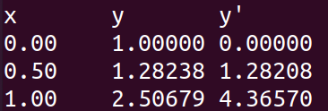
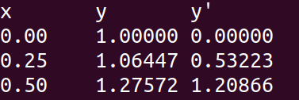

# Runge–Kutta Methods for a Second-Order Initial Value Problem

This repository contains C implementations of Runge–Kutta methods for approximating the solution of a nonlinear second-order ordinary differential equation. It also includes a short LaTeX report and numerical results obtained with two different step sizes.

## Problem statement

The initial value problem is

$$y''-2xy'-y=y^2e^{-x^2},$$

with initial conditions

$$y(0)=1,\qquad y'(0)=0.$$

Introducing

$$z=y',$$

transforms the equation into the first-order system

$$y'=z,$$

$$z'=2xz+y+y^2e^{-x^2}.$$

The numerical implementations advance both dependent variables, $y$ and $z=y'$, at every integration step.

## Numerical methods

### Classical fourth-order Runge–Kutta method

The main implementation in [`code/rk4.c`](code/rk4.c) applies the classical fourth-order Runge–Kutta method to the coupled first-order system. The current program starts from $(x_0,y_0,z_0)=(0,1,0)$, uses $h=0.25$, and performs two integration steps.

For a generic system

$$y'=F(x,y,z),\qquad z'=G(x,y,z),$$

the method evaluates four intermediate slopes for each variable and combines them using the standard RK4 weighted average.

### Second-order Runge–Kutta method

The file [`code/Runge_Kutta_2nd_order.c`](code/Runge_Kutta_2nd_order.c) implements a second-order midpoint Runge–Kutta scheme for comparison. Its default configuration uses $h=0.25$ and performs ten steps.

## Repository structure

```text
Runge_Kutta/
├── code/
│   ├── rk4.c                         # Working fourth-order Runge–Kutta implementation
│   ├── Runge_Kutta_2nd_order.c       # Working second-order midpoint implementation
│   ├── RungeKutta.c                  # Early experimental draft
│   ├── rk4                            # Precompiled Linux executable
│   └── Runge_Kutta_2nd                # Precompiled Linux executable
├── report/
│   ├── Tarea3.tex                    # Original Spanish LaTeX report
│   ├── Tarea3.pdf                    # Compiled original report
│   ├── rkh05.png                     # Numerical results for h = 0.5
│   └── rkh025.png                    # Numerical results for h = 0.25
├── report_EN/
│   └── Tarea3_EN.tex                 # English translation of the report
└── README.md
```

The precompiled executables were built for 64-bit Linux. Compiling the source files locally is recommended for portability.

## Requirements

- A C compiler with C99 support, such as GCC or Clang
- The standard C math library
- A LaTeX distribution such as TeX Live or MiKTeX to compile the reports

## Compilation and execution

From the repository root, compile the fourth-order implementation with

```bash
gcc -std=c99 -Wall -Wextra code/rk4.c -lm -o rk4
```

Run it with

```bash
./rk4
```

Compile and run the second-order implementation with

```bash
gcc -std=c99 -Wall -Wextra code/Runge_Kutta_2nd_order.c -lm -o rk2
./rk2
```

The primary build instructions intentionally use `rk4.c` and `Runge_Kutta_2nd_order.c`. The file `RungeKutta.c` is retained as an early draft and is not part of the working build.

## Example RK4 output

Using $h=0.25$ for two steps produces

```text
x       y         y'
0.00    1.00000   0.00000
0.25    1.06447   0.53223
0.50    1.27572   1.20866
```

## Numerical results

### Step size h = 0.5



### Step size h = 0.25



A smaller step size generally provides a more refined approximation because the numerical solution is evaluated at more closely spaced points. A rigorous accuracy comparison would additionally require an exact solution or a sufficiently accurate reference solution.

## Compiling the reports

Compile the original Spanish report with

```bash
cd report
pdflatex Tarea3.tex
pdflatex Tarea3.tex
```

Compile the English report with

```bash
cd report_EN
pdflatex Tarea3_EN.tex
pdflatex Tarea3_EN.tex
```

Running `pdflatex` twice resolves cross-references and bibliography numbering.

## Author

**BSc. Julio Medina**<br>
University of San Carlos<br>
School of Physical and Mathematical Sciences<br>
Master's Degree in Physics

## Reference

Richard L. Burden and J. Douglas Faires, *Numerical Analysis*, 9th ed., Brooks/Cole, Cengage Learning. ISBN 978-0-538-73351-9.
